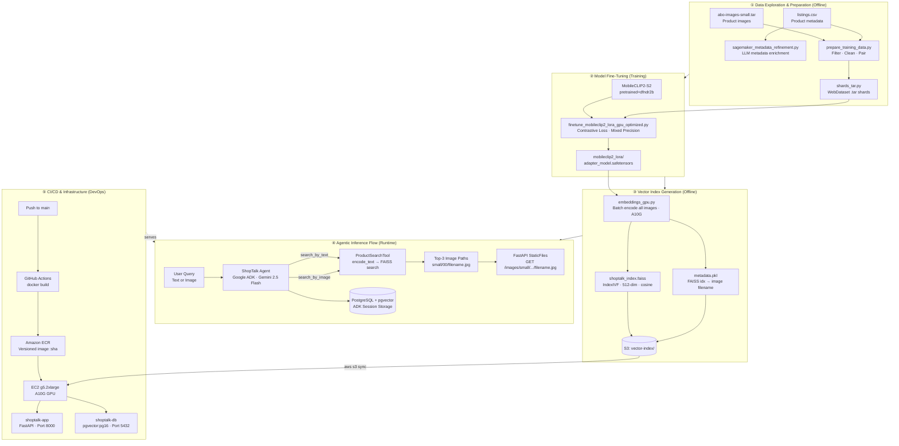

# ShopTalk AI 🛍️

> Visual shopping assistant powered by **MobileCLIP2** fine-tuned with **LoRA**, **FAISS** vector search, and **Google ADK** with Gemini 2.5 Flash.

---

## Architecture
👉 [Interactive Architecture](https://prudviraj2808.github.io/shoptalk-ai/)




---

## Stack

| Layer | Technology |
|---|---|
| Base Model | MobileCLIP2-S2 (`open_clip`, pretrained=dfndr2b) |
| Fine-Tuning | LoRA (`peft`) · Contrastive loss · Mixed precision |
| Vector Search | FAISS IndexIVF · 512-dim cosine similarity |
| Agent Framework | Google ADK · Gemini 2.5 Flash |
| API | FastAPI · Uvicorn |
| Database | PostgreSQL 16 + pgvector |
| Compute | AWS EC2 g5.2xlarge (NVIDIA A10G GPU) |
| Registry | Amazon ECR |
| Storage | Amazon S3 |
| CI/CD | GitHub Actions |

---

## Project Structure

```
shoptalk-ai/
├── .env.example
├── README.md
├── docker-compose.yml
├── pyproject.toml
├── main.py
├── start.sh
├── agents/
│   └── shopping_agent/
│       └── agent.py              # Google ADK agent + tool definitions
├── tools/
│   └── product_search.py         # ProductSearchTool — FAISS search singleton
├── utils/
│   └── database.py               # Async SQLAlchemy engine + pgvector init
├── train/
│   ├── finetune_mobileclip2_lora_gpu_optimized.py
│   ├── finetune.py
│   ├── prepare_training_data.py
│   ├── conversion_script.py
│   └── sagemaker_metadata_refinement.py
├── scripts/
│   ├── embeddings_gpu.py         # Build FAISS index from fine-tuned model
│   ├── embeddings.py
│   └── shards_tar.py             # Pack images into WebDataset shards
├── docker/
│   └── Dockerfile                # Multi-stage build (uv + python:3.12-slim)
├── model/
│   └── mobileclip2_lora/         # LoRA adapter weights
├── abo_data/
│   └── abo-images-small/
│       └── images/               # Product images served at GET /images/
├── training_data/
│   ├── full_metadata.jsonl
│   ├── refined_sagemaker_metadata.jsonl
│   └── images/
│       ├── 00/
│       ├── 01/
│       └── ...
└── .github/
    └── workflows/
        └── deploy.yml            # CI/CD → ECR → EC2
```

---

## Data Preparation & Fine-Tuning

### 1. Prepare Training Data

Extract, balance, and organize your dataset:

```bash
uv run train/prepare_training_data.py
```

- Extracts metadata and images from tar files and CSV.
- Balances the dataset so each product category has exactly 100 entries (upsampling or downsampling as needed).
- Saves images to `training_data/images/` in subfolders by hash prefix.
- Outputs `training_data/full_metadata.jsonl` with fields:
  - `item_id` — unique item identifier
  - `text` — item name or caption
  - `image_path` — relative path to the extracted image
  - `metadata` — additional attributes

---

### 2. Metadata Refinement

Refine captions using a SageMaker-hosted LLM:

```bash
uv run train/sagemaker_metadata_refinement.py
```

- Processes `full_metadata.jsonl` → `refined_sagemaker_metadata.jsonl`
- Output fields: `image_path`, `refined_caption`

---

### 3. Convert to WebDataset Format

Package images and captions into tar shards for efficient GPU streaming:

```bash
uv run train/conversion_script.py
```

- Creates `mobileclip_data_*.tar` files.
- Each tar contains JPEG images and captions with keys `jpg` and `txt`.

---

### 4. Fine-Tune MobileCLIP2 with LoRA

```bash
uv run train/finetune.py
```

- Loads tar files, applies LoRA adapters, trains with contrastive loss.
- LoRA weights saved to `output/mobileclip2_lora/` (adapter_model.safetensors).
- For GPU-optimised training on A10G: use `finetune_mobileclip2_lora_gpu_optimized.py`

---

### 5. Build FAISS Index

Embed all product images and build the search index:

```bash
uv run scripts/embeddings_gpu.py
```

- Batch encodes all images (batch=256) using the fine-tuned model on A10G GPU.
- Outputs `shoptalk_index.faiss` + `metadata.pkl`.
- Upload both to S3: `s3://your-bucket/vector-index/`

---

### Example Data Flow

```
prepare_training_data.py          →  training_data/full_metadata.jsonl + images
sagemaker_metadata_refinement.py  →  training_data/refined_sagemaker_metadata.jsonl
conversion_script.py              →  mobileclip_data_*.tar shards
finetune.py                       →  model/mobileclip2_lora/ (LoRA weights)
embeddings_gpu.py                 →  shoptalk_index.faiss + metadata.pkl
                                  →  upload to S3: vector-index/
```

---

## Local Development

### Services

| Service | URL | Purpose |
|---|---|---|
| FastAPI + ADK UI | http://localhost:8000 | Agent web interface |
| PostgreSQL | localhost:5432 | Session storage (pgvector) |

```bash
# Copy and fill in your env vars
cp .env.example .env

# Start all services
docker compose up --build
```

**Database connection:**
```
Host (local):     localhost:5432
Host (internal):  db:5432
User:             user
Database:         shoptalk
```

> `db` is used as the host internally because Docker Compose uses service names as hostnames on its internal network.

---

## Deployment (EC2 g5.2xlarge)

### Prerequisites
1. EC2 instance bootstrapped — Docker, NVIDIA drivers, nvidia-container-toolkit installed
2. IAM role attached with `AmazonEC2ContainerRegistryReadOnly` + `AmazonS3ReadOnlyAccess`
3. GitHub Secrets configured — see table below

### GitHub Secrets Required

| Secret | Value |
|---|---|
| `AWS_ACCESS_KEY_ID` | AWS access key |
| `AWS_SECRET_ACCESS_KEY` | AWS secret key |
| `AWS_DEFAULT_REGION` | `us-east-1` |
| `ECR_REPOSITORY` | `shoptalk-ai` |
| `S3_BUCKET` | `shoptalk-assets-storage` |
| `EC2_HOST` | EC2 public IP |
| `EC2_SSH_KEY` | Contents of `.pem` key file |
| `DB_PASSWORD` | Strong PostgreSQL password |
| `GOOGLE_API_KEY` | Google API key |
| `ENDPOINT_NAME` | SageMaker endpoint name |

### Trigger Deploy

```bash
# Automatic — push to main
git push origin main

# Manual — GitHub → Actions → CI/CD → Run workflow
```

### Pipeline Stages

```
build-and-push   ~4-5 min   docker build → push :sha + :latest to ECR
deploy           ~1-2 min   SSH → s3 sync → docker pull → compose up
health-check     ~30 sec    curl EC2:8000/health → 200 OK
```

---

## Troubleshooting

- **Missing images** — Check `abo_data/abo-images-small/images/` is mounted correctly in Docker
- **FAISS index not found** — Run `aws s3 sync s3://your-bucket/vector-index/ ./vector-index/` on EC2
- **CUDA not available** — Verify `nvidia-smi` works and `nvidia-container-toolkit` is configured
- **DB connection error** — Ensure `DB_PASSWORD` secret matches `.env` on EC2
- **Input shape errors** — Ensure batching is handled only once in the training pipeline
- **Multiprocessing issues on Windows** — Protect entry points with `if __name__ == "__main__":`

---


